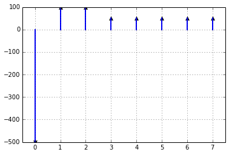

# Economics Fundamentals

Finances dictate most energy decisions and we choose the technology that
is the least cost according to some criteria.  In this chapter we
introduce a few criteria that are commonly used.

## Learning Objectives

- Calculate equivalent sums of money using discount rates
- Able to use the net present value (NPV) to get present value of future investments
- Able to use the internal rate of return (IRR) to quantify an energy investment
- Able to use the capital recovery function (CRF) to estimate a loan payment
- Recognize cost of conserved energy (CCE) and  cost of conserved carbon

## Concepts
- Time Value of Money
- Equivalence and Comparison Principle
- Net Present Value (NPV)
- Future Value
- Discounting
- Discount rate
- Interest rate

# Time Value of Money

## Equivalence principle
- Given a choice between money now and money later, most demand a larger
  value at a later date
- When someone is indifferent between sum 1 now and sum 2 at a fixed
  later date, the sums are considered equivalent
- This equivalence can be expressed using a discount rate

## Discount rate vs. Interest rate

- Discount rate usually refers to personal preferences
- Interest rate is usually a real rate charged by a bank

## Discount Rate and Net Present Value
$$\textrm{Present Value (USD)} =
\frac
{\textrm{Future Amount (USD)}}
{(1 + \textrm{Discount Rate})^{\textrm{number of years in future}} }$$

$$P = \frac {F} {(1 + i)^{n} }$$

## Present Value Notation
Single payment
$$ PV = \frac{C}{(1+i)^n} $$

Stream of payments
$$ PV = C_0 +
        \frac{C_1}{1+i} +
        \frac{C_2}{(1+i)^2} +
        \dots +
        \frac{C_N}{(1+i)^N}$$

Compact notation
$$ PV = \sum_{n=0}^{N} \frac{C_n}{(1+i)^n}$$

## Monthly vs. Yearly interest rates

- Many types of loans advertise a yearly interest rate, but charge
    interest monthly.
- The yearly interest rate is the APR or annual percentage rate
- To find the monthly rate divide this by twelve
- $i$ is the annual percentage rate
- $n$ is the number of periods in months

$$ FV = PV (1 + i/12)^{n} $$

## Cash flow diagrams

## Concepts
- Internal Rate of Return (IRR)
- Capital Recovery Function (CRF)
- Spreadsheet solution for CRF
- Inflation

## Internal Rate of Return
- Finding the IRR is the equivalent of asking, here is a loan, what was the interest rate you got?
- Tells us at what interest rate a cash flow has a net present value of
  zero
- We will look at this on a spreadsheet
- This doesn't have a closed-form solution
- Usually solved by a computer

# Inflation

## Inflation

- The cost of goods usually rises over time
- This rate is monitored by the [Consumer Price Index](http://www.bls.gov/cpi/)
- As prices rise, the value of money decreases

## Inflation

$$ 1 + r_0 = \frac{1+r}{1+f} $$

- $r_0$ is the effective rate of interest
- $r$ is the nominal rate of interest
- $f$ is the inflation rate

For small inflation rates,

$$ r_0 \approx r - f $$

# Capital Recovery Function

## Capital Recovery Factor
Suppose we make a loan.  We want to know what the yearly payment is so
that the present value of all payments is equal to the loan amount.

This formula allows us to calculate this payment.

$$CRF = \frac {i(1+i)^n}{(1+i)^n-1}$$

# Conserved Cost of Energy

The conserved cost of energy is cost of the equivalent purchase of
energy to a conservation measure.

This allows us to compare this metric to the cost of energy.

$$ CCE = \frac{\textrm{annual extra investment cost}}{\textrm{annual energy savings}} $$

The key to this is a clear definition of the two scenarios you are
comparing.  The cost is the difference in cost and the energy is the
difference in energy between the two scenarios.

The 1984 paper by Alan Meier uses the capital recovery function to convert the overall investment cost to a periodic cost with the appropriate discount rate.

# Cost of Avoided Carbon

Similar to this is the cost of avoided carbon.
In this case the annual energy savings can be substituted with the annual carbon savings.
We would compare this to the cost of carbon in the carbon markets to determine whether it is an appropriate investment.
