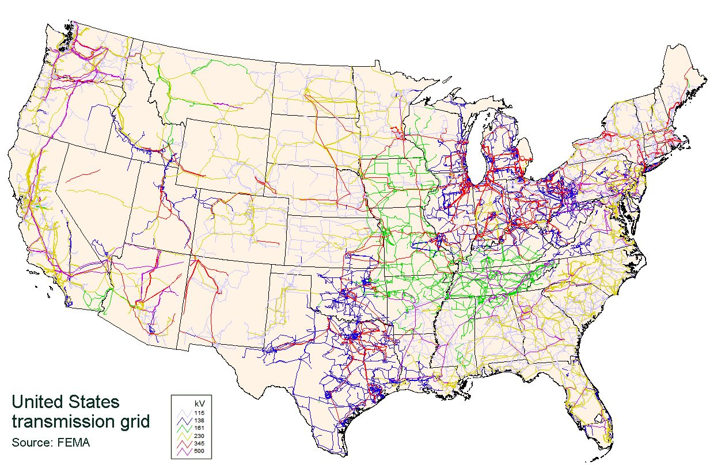
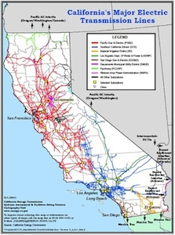
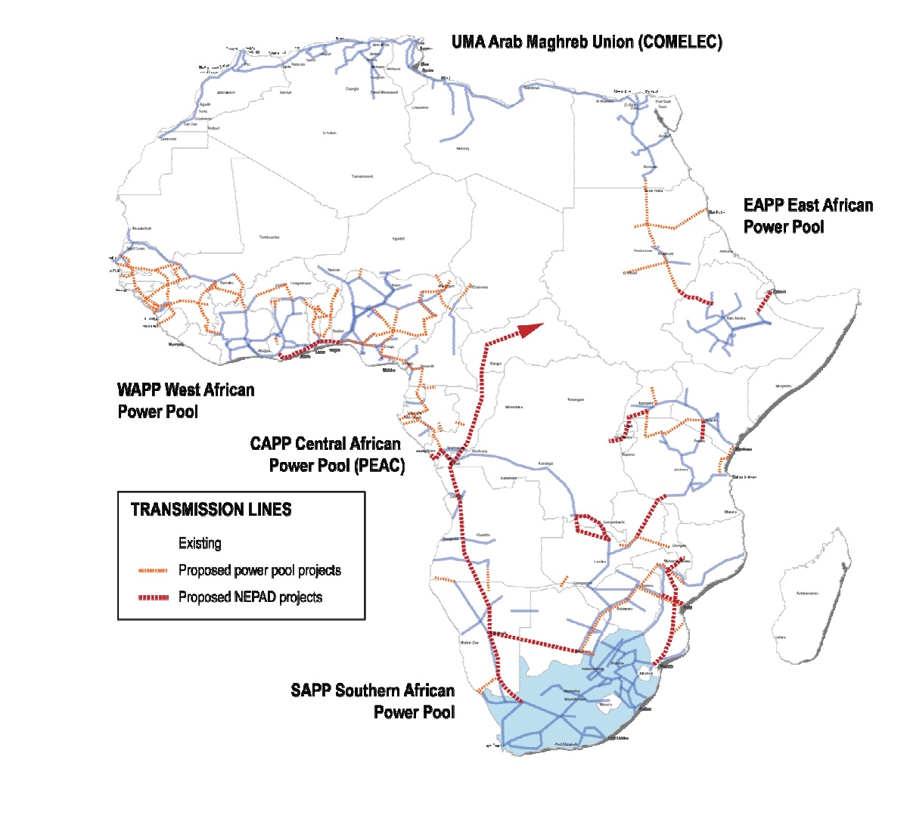
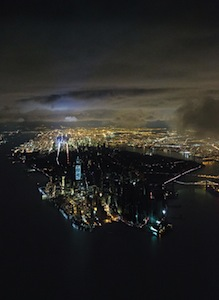
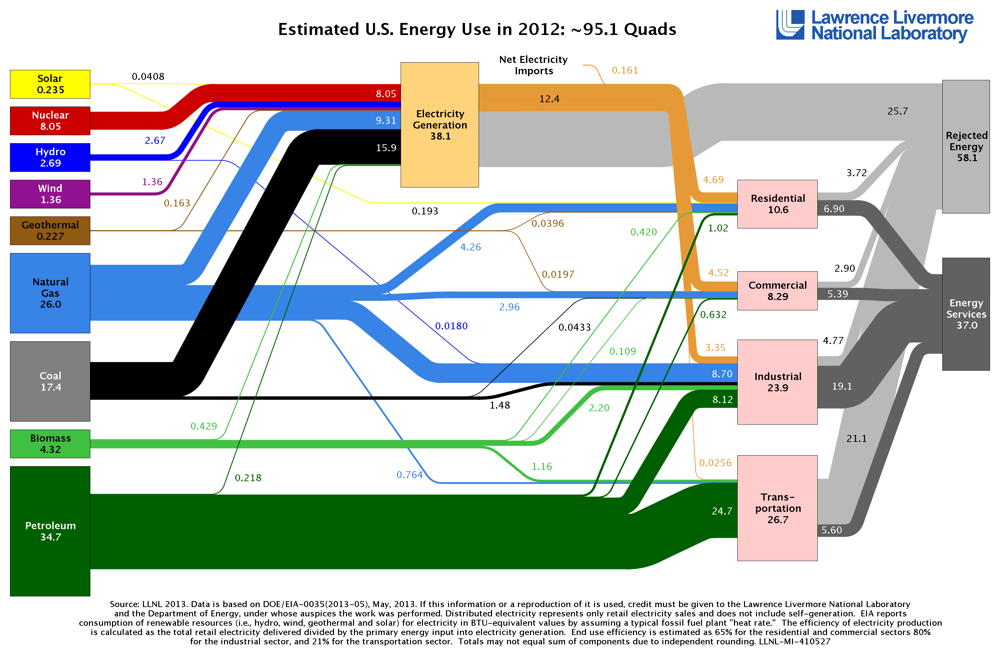
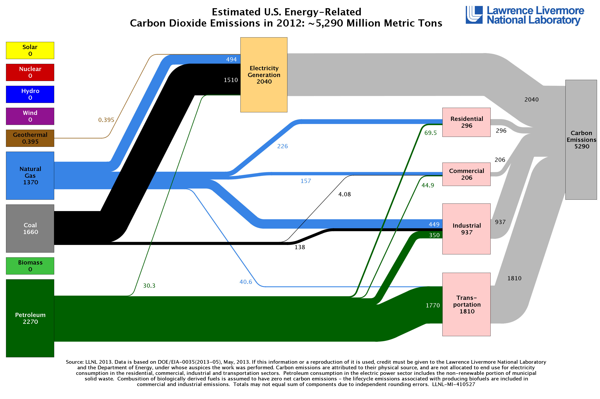

# Guiding Questions
- How can we services from electricity with the least environmental impact?
# Learning objectives
- You will understand and apply basic principles of electricity
- You will learn to use models to simplify complex problems and make
  accurate estimates
- You will calculate cost and energy impacts of electrical efficiency
  measures
- You will learn to research new options for efficiency savings.

# Learning objectives
- You will understand and apply basic principles of electricity
- You will learn to use models to simplify complex problems and make accurate estimates
- You will calculate cost and energy impacts of electrical efficiency measures
- You will learn to research new options for efficiency savings.

# Basic principles of electricity
- Ohms Law
- Electromagnetic Induction
- Alternating Current

# Model thinking
- A model is an approximation that allows us to understand and make
  predictions about a system
- All are models are wrong, some are useful
- How do you separate the important factors in a model from the less
  significant?
- How do you determine which models to use?
- Ohm's Law is a model

# Research skills
- How do you discover more about a topic?
- How do you synthesize this information to answer a question?
- How do you find the right question to ask?

# Introduction
- Why is this topic important?
- Electricity is a significant energy use in our society
- Electricity is primarily generated with coal which creates climate
  risk and health impacts

# Electricity System
- Incredibly large and complex
- Evolved over time
- Has significant problems

#

<!--
- not much transmission where new renewable resources would be
-->

##

## African Transmission Network

<!-- [African Transmission Network](http://www.geni.org/globalenergy/library/national_energy_grid/africa/africanelectricitygrid.shtml) -->

## Our Electricity System is Fragile

<!-- 2014 replace these with actual images -->

## Flow Diagrams
[Sankey Energy Diagram](https://flowcharts.llnl.gov/content/energy/energy_archive/energy_flow_2012/2012new2012newUSEnergy.png)

[Sankey Carbon Diagram](https://flowcharts.llnl.gov/content/carbon/carbon_emissions_2012/2012_US_Carbon.png)

## Flow Diagrams

## US Energy Sankey

## US Carbon Sankey

