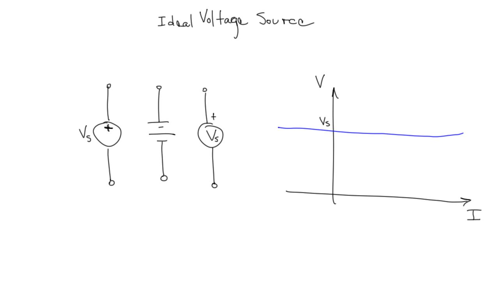
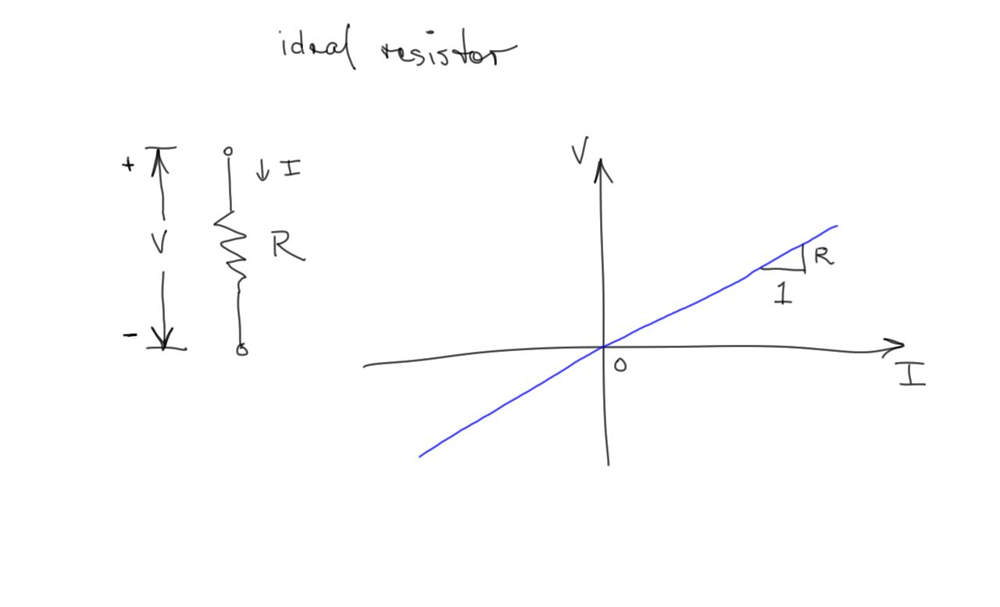
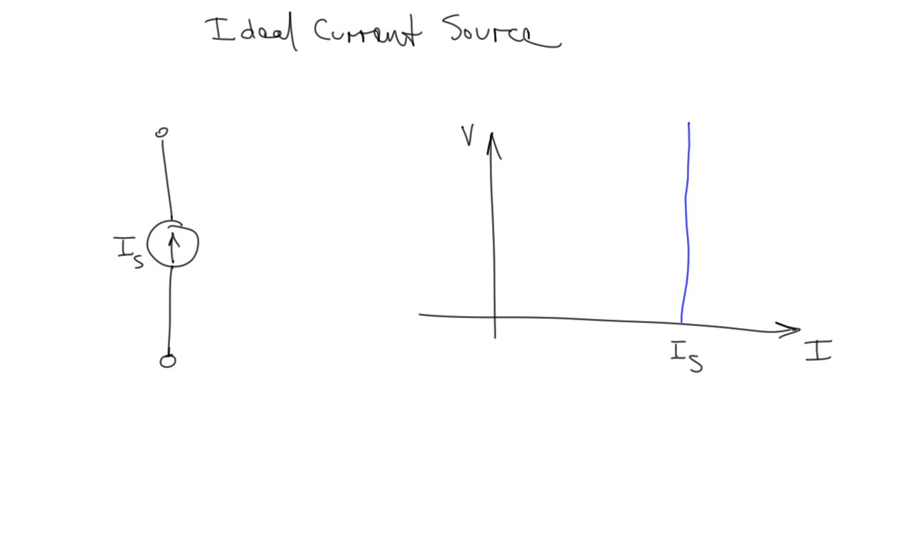
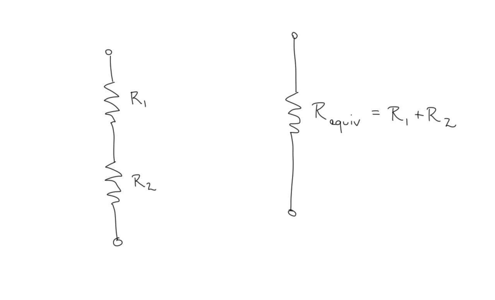
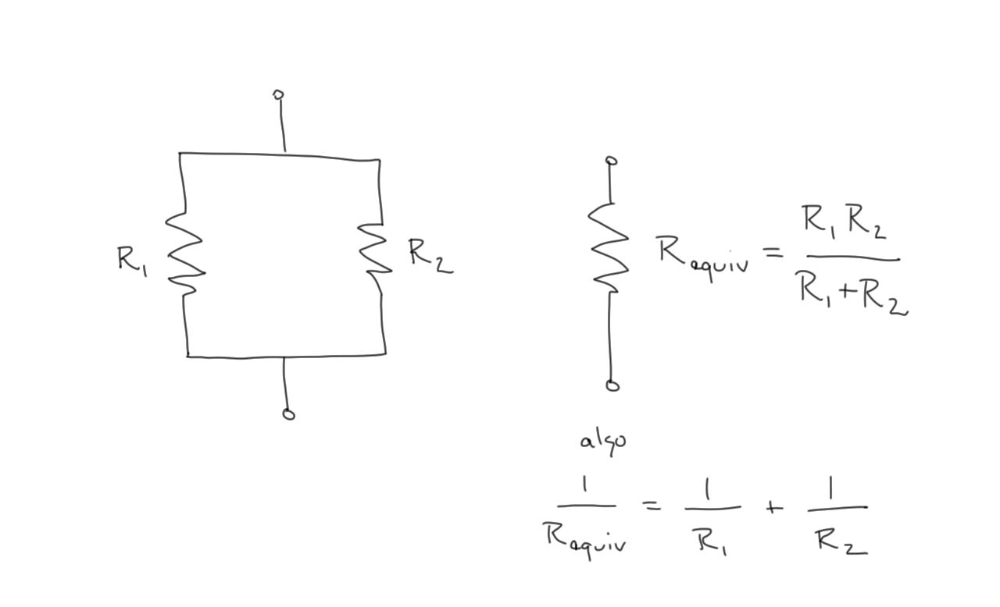

# Energy

We will focus on the elements of electric theory that are most closely related to the expenditure of energy in electrical systems.

## Energy in a circuit element
- Any circuit element with a given voltage and current is consuming power equal to the product of the current and the voltage
- If the voltage is in volts, and the current is in amperes, the resulting power is in units of watts.

$$ P = IV $$

# Ideal elements
## Idealized circuit representation
- Lines have no resistance and uniform voltage
- Real elements (heaters, filaments, batteries) are represented as ideal
  models

## Example
- Simple light
- Sketch physical representation
- Sketch wiring diagram
- Sketch schematic
- Apply mathematical models
<!-- sketch on paper in notes -->

## Ideal Voltage Source
- An ideal voltage source can deliver any amount of current while
  holding its voltage constant.
- 

## Ideal Resistor
An ideal resistor obeys Ohm's Law, $V=IR$

## Ohm's Law
$$ V = IR $$
The current in a resistor is proportional to the voltage across it.
The constant of proportionality is the resistance.

## Ideal Current Source
- An ideal current source delivers a fixed amount of current no matter
  the voltage at its terminals
- 

## Kirchhoff's Current Law
- The sum of currents flowing into a node must equal the sum of the
  currents leaving the node at any instant.
- Water flow or automobile traffic provide some intuition.

## Kirchhoff's Voltage Law
- The sum of the voltages around any loop of a circuit at any instant is
  zero.
- Hiking a trail provides some intuition.

## Equivalent resistances
- We can use Ohm's Law and Kirchoff's Laws to determine an equivalent
  resistance to model a network of resistors.

## Resistors in series
- Resistors in series have the same current flowing through each one

## Resistors in parallel
- Resistors in parallel have the same voltage across their terminals
- 

## Relationship to energy
- One coulomb of charge raised to a potential of one volt gains one
  Joule of energy

## Relationship to power
- Voltage is energy per charge
- Current is charge per time
- Voltage times current has units of energy per time or power
- $\frac{energy}{charge} \cdot \frac{charge}{time}$
- $P = VI$

## Power
$$ P = VI $$
The power dissipated by a device is equal to the voltage across it
multiplied by the current flowing through it.

## Voltage and current directions

## Delivered power
- Power delivered by an ideal voltage source
<!-- written -->

## Consumed power
- Power consumed by an ideal resistor
<!-- written -->

## Energy
- The energy consumed is equal to the power multiplied by the time.
- The energy unit we use is kWh (kilowatt-hour)
- A 1 kW device consuming power for 1 hour uses 1 kWh of electricity

## Tariff
- The utility charges proportional to the amount of kWh consumed
- Some consumers are also charged according to the maximum power
  observed

## Wire resistance
- Resistivity - property of the material - intensive
- Resistance - property of the wire - extensive

## Wire resistance

$$R = resistivity \cdot \frac{length}{area}$$
$$R = \rho \frac{l}{A}$$

- The resistance of a wire is proportional to
    - the resistivity of the material
    - the length of the wire
- It is inversely proportional to
    - the cross-sectional area

## Units
- To get proper units of resistance in ohms
- Resistivity is expressed in Ohm/meter
- Length in meters
- Area in square meters

